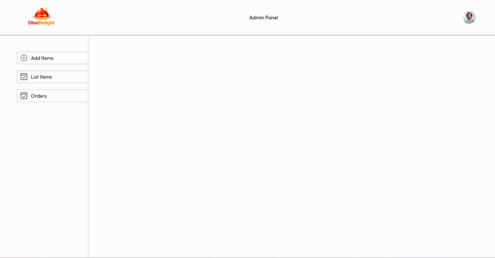
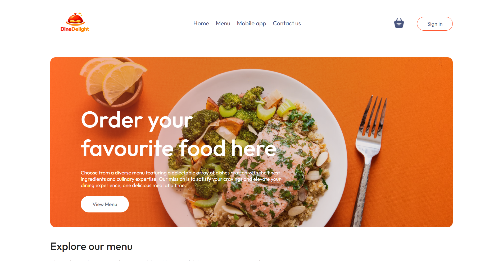

# 🍔 Food Delivery App

A full-stack food delivery web application built with the **MERN stack** (MongoDB, Express, React, Node.js). The platform allows customers to browse food items, add them to cart, place orders with Stripe payments, and track their orders — all managed through a dedicated admin panel.

---

## 🚀 Live Demo

> _Add your deployed links here_
> - **Frontend:** `https://food-del-frontend-d28h.onrender.com/`
> - **Admin Panel:** `https://food-del-admin-cicp.onrender.com`

---

## ✨ Features

### 👤 Customer (Frontend)
- Browse food items by category
- Add / remove items from cart
- User authentication (Register & Login with JWT)
- Place orders with **Stripe** payment integration
- View and track order history

### 🛠️ Admin Panel
- Add new food items with image uploads
- View & manage the complete food list
- Update order statuses in real time

### ⚙️ Backend API
- RESTful API with Express.js
- JWT-based authentication & authorization
- Secure password hashing with bcrypt
- File uploads handled via Multer
- MongoDB database with Mongoose ODM

---

## 🗂️ Project Structure

```
food-del/
├── frontend/        # Customer-facing React app
├── admin/           # Admin panel React app
└── backend/         # Node.js + Express REST API
```

---

## 🛠️ Tech Stack

| Layer     | Technology                                      |
|-----------|-------------------------------------------------|
| Frontend  | React 18, React Router v6, Axios, React Toastify, Stripe.js |
| Admin     | React 18, React Router v6, Axios, React Toastify |
| Backend   | Node.js, Express.js, MongoDB, Mongoose          |
| Auth      | JSON Web Tokens (JWT), bcrypt                   |
| Payments  | Stripe                                          |
| Uploads   | Multer                                          |
| Dev Tools | Vite, Nodemon, ESLint                           |

---

## ⚙️ Getting Started

### Prerequisites

Make sure you have the following installed:
- [Node.js](https://nodejs.org/) (v16+)
- [MongoDB](https://www.mongodb.com/) (local or Atlas)
- A [Stripe](https://stripe.com/) account for payment keys

---

### 1️⃣ Clone the Repository

```bash
git clone https://github.com/your-username/food-del.git
cd food-del
```

---

### 2️⃣ Backend Setup

```bash
cd backend
npm install
```

Create a `.env` file in the `backend/` directory:

```env
PORT=4000
MONGODB_URI=your_mongodb_connection_string
JWT_SECRET=your_jwt_secret_key
STRIPE_SECRET_KEY=your_stripe_secret_key
```

Start the backend server:

```bash
npm run server
```

> The API will be running at `http://localhost:4000`

---

### 3️⃣ Frontend Setup

```bash
cd ../frontend
npm install
npm run dev
```

> The customer app will be running at `http://localhost:5173`

---

### 4️⃣ Admin Panel Setup

```bash
cd ../admin
npm install
npm run dev
```

> The admin panel will be running at `http://localhost:5174`

---

## 📡 API Endpoints

| Method | Endpoint              | Description                  | Auth Required |
|--------|-----------------------|------------------------------|---------------|
| POST   | `/api/user/register`  | Register a new user          | ❌            |
| POST   | `/api/user/login`     | Login user                   | ❌            |
| GET    | `/api/food/list`      | Get all food items           | ❌            |
| POST   | `/api/food/add`       | Add a food item (admin)      | ✅            |
| DELETE | `/api/food/remove`    | Remove a food item (admin)   | ✅            |
| POST   | `/api/cart/add`       | Add item to cart             | ✅            |
| POST   | `/api/cart/remove`    | Remove item from cart        | ✅            |
| POST   | `/api/cart/get`       | Get cart data                | ✅            |
| POST   | `/api/order/place`    | Place an order (Stripe)      | ✅            |
| POST   | `/api/order/verify`   | Verify payment               | ✅            |
| POST   | `/api/order/userorders` | Get user's orders           | ✅            |
| GET    | `/api/order/list`     | Get all orders (admin)       | ✅            |
| POST   | `/api/order/status`   | Update order status (admin)  | ✅            |

---

## 📸 Screenshots




---

## 🤝 Contributing

Contributions are welcome! Feel free to open an issue or submit a pull request.

1. Fork the repository
2. Create your feature branch: `git checkout -b feature/your-feature`
3. Commit your changes: `git commit -m 'Add some feature'`
4. Push to the branch: `git push origin feature/your-feature`
5. Open a Pull Request

---

## 📄 License

This project is licensed under the [ISC License](LICENSE).

---

## 👨‍💻 Author

**Rishabh Singh**  
[](https://github.com/deathstroke2306)

---

> ⭐ If you found this project useful, consider giving it a star!
